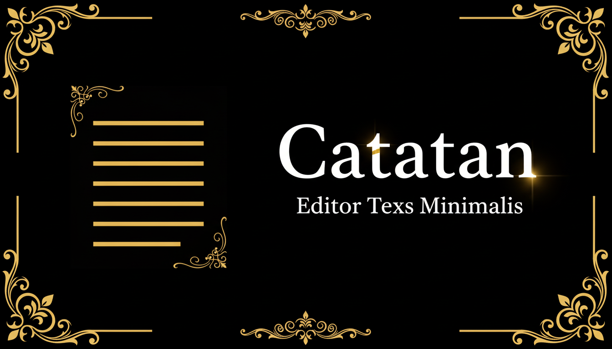

# ✍️ Markdown Editor Pro

Editor Markdown modern dengan fitur lengkap, preview real-time, dan penyimpanan otomatis. Dibangun dengan React, TypeScript, dan Tailwind CSS.



## ✨ Fitur Utama

### 📝 Editor
- **Live Preview** - Lihat hasil markdown secara real-time
- **Syntax Highlighting** - Highlight kode dengan berbagai bahasa pemrograman
- **Auto-save** - Dokumen tersimpan otomatis setiap perubahan
- **URL Sharing** - Bagikan dokumen via URL dengan kompresi otomatis

### 📋 Markdown Support
- **Headers** (H1-H6)
- **Bold, Italic, Strikethrough**
- **Lists** (ordered & unordered)
- **Checklist/Task List** dengan checkbox interaktif ✅
- **Code Blocks** dengan syntax highlighting
- **Tables** dengan alignment
- **Links & Images**
- **Blockquotes**
- **Horizontal Rules**

### 🖼️ Image Lightbox
- Klik gambar untuk memperbesar
- Zoom in/out dengan tombol atau keyboard (+/-)
- Rotate gambar (R)
- Navigasi dengan keyboard (Esc untuk tutup)

### 📂 Manajemen Dokumen
- Simpan multiple dokumen
- Rename dokumen
- Delete dokumen
- Export ke HTML, TXT, atau Markdown
- Backup & restore semua dokumen

### 🎨 Tema
- **Light Mode** - Tampilan terang
- **Dark Mode** - Tampilan gelap
- **System** - Mengikuti preferensi sistem

### 📱 Responsive Design
- Desktop, tablet, dan mobile friendly
- Floating menu untuk akses cepat
- QR Code sharing untuk akses mobile

## 🚀 Cara Penggunaan

### Instalasi

```bash
# Clone repository
git clone <YOUR_GIT_URL>

# Masuk ke direktori project
cd <YOUR_PROJECT_NAME>

# Install dependencies
npm install

# Jalankan development server
npm run dev
```

### Keyboard Shortcuts

| Shortcut | Aksi |
|----------|------|
| `Esc` | Tutup lightbox/modal |
| `+` / `=` | Zoom in gambar |
| `-` | Zoom out gambar |
| `R` | Rotate gambar |

### Contoh Markdown

```markdown
# Judul Dokumen

## Checklist
- [x] Task yang sudah selesai
- [ ] Task yang belum selesai

## Kode
\`\`\`javascript
console.log('Hello World!');
\`\`\`

## Tabel
| Nama | Nilai |
|------|-------|
| A    | 100   |
| B    | 90    |

## Gambar

```

## 🛠️ Tech Stack

- **Frontend Framework**: React 18
- **Build Tool**: Vite
- **Language**: TypeScript
- **Styling**: Tailwind CSS
- **UI Components**: shadcn/ui
- **Animations**: Framer Motion
- **Icons**: Lucide React
- **Syntax Highlighting**: Highlight.js
- **Compression**: Pako (untuk URL sharing)
- **QR Code**: qrcode.react

## 📁 Struktur Project

```
src/
├── components/
│   ├── ui/              # shadcn/ui components
│   ├── Editor.tsx       # Komponen editor
│   ├── MarkdownPreview.tsx  # Preview markdown
│   ├── ImageLightbox.tsx    # Lightbox untuk gambar
│   ├── FloatingMenu.tsx     # Menu floating
│   ├── DocumentsSidebar.tsx # Sidebar dokumen
│   ├── StatusBar.tsx        # Status bar
│   └── QRModal.tsx          # Modal QR code
├── hooks/
│   ├── useDocument.ts   # Hook untuk dokumen
│   ├── useDocuments.ts  # Hook untuk list dokumen
│   └── useTheme.ts      # Hook untuk tema
├── lib/
│   ├── markdown.ts      # Parser markdown
│   ├── compression.ts   # Utilitas kompresi
│   ├── storage.ts       # Local storage
│   └── utils.ts         # Utilitas umum
├── pages/
│   └── Index.tsx        # Halaman utama
└── index.css            # Global styles
```

## 🔧 Konfigurasi

### Environment Variables

Tidak ada environment variables yang diperlukan untuk menjalankan aplikasi ini secara lokal.

### Customization

- **Tema**: Edit `src/index.css` untuk mengubah warna dan styling
- **Markdown Parser**: Edit `src/lib/markdown.ts` untuk menambah fitur markdown
- **Komponen UI**: Semua komponen ada di `src/components/`

## 📦 Build & Deploy

```bash
# Build untuk production
npm run build

# Preview build
npm run preview
```

### Deploy ke Lovable

1. Buka project di Lovable
2. Klik **Share** → **Publish**
3. Aplikasi akan live di URL Lovable

## 🤝 Kontribusi

1. Fork repository
2. Buat branch fitur (`git checkout -b feature/AmazingFeature`)
3. Commit perubahan (`git commit -m 'Add some AmazingFeature'`)
4. Push ke branch (`git push origin feature/AmazingFeature`)
5. Buat Pull Request

## 📄 Lisensi

Distributed under the MIT License.

## 🙏 Credits

- [shadcn/ui](https://ui.shadcn.com/) - Komponen UI
- [Highlight.js](https://highlightjs.org/) - Syntax highlighting
- [Framer Motion](https://www.framer.com/motion/) - Animasi
- [Lucide](https://lucide.dev/) - Icons

---

**Made with ❤️ using [Lovable](https://lovable.dev)**
